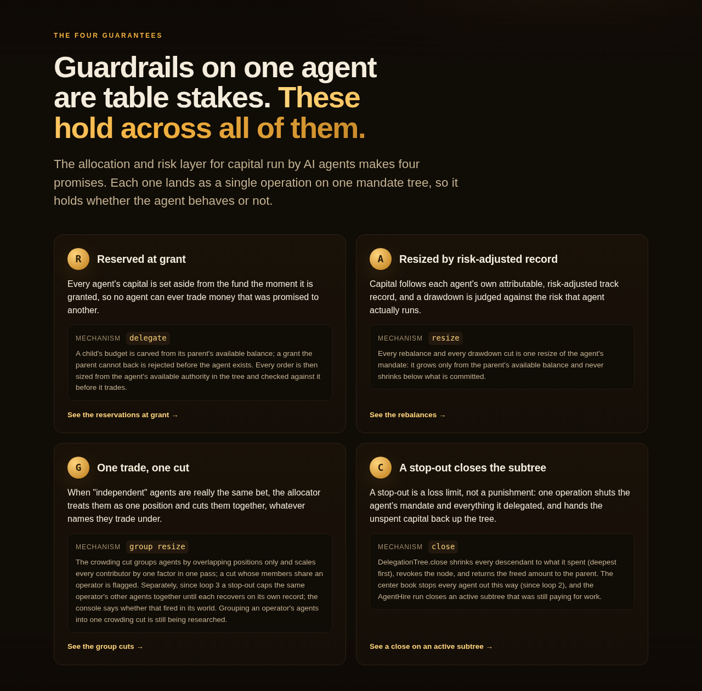
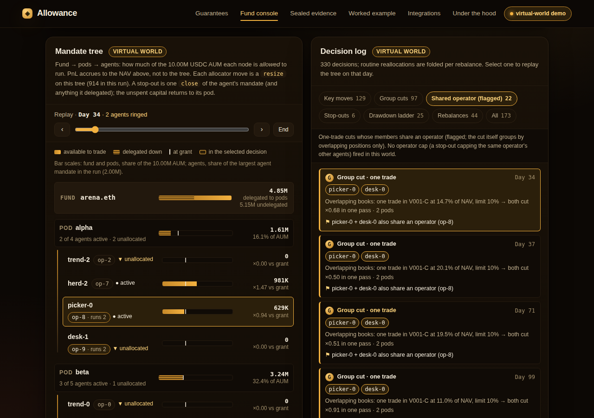
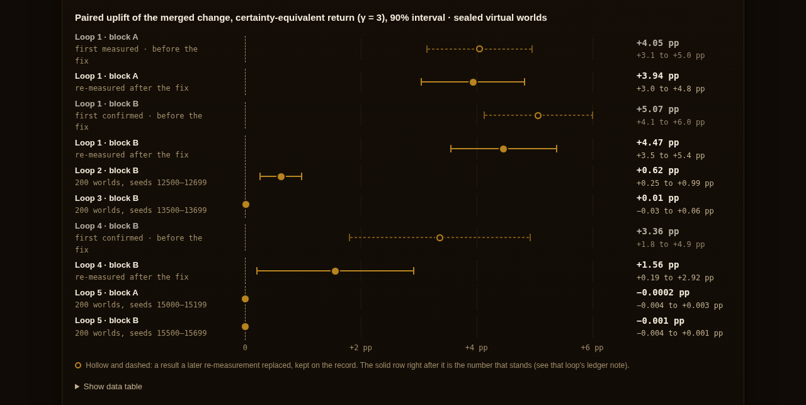
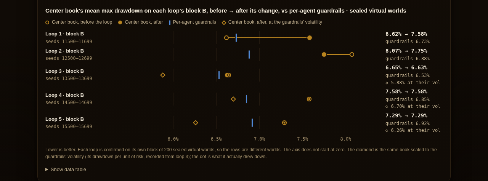
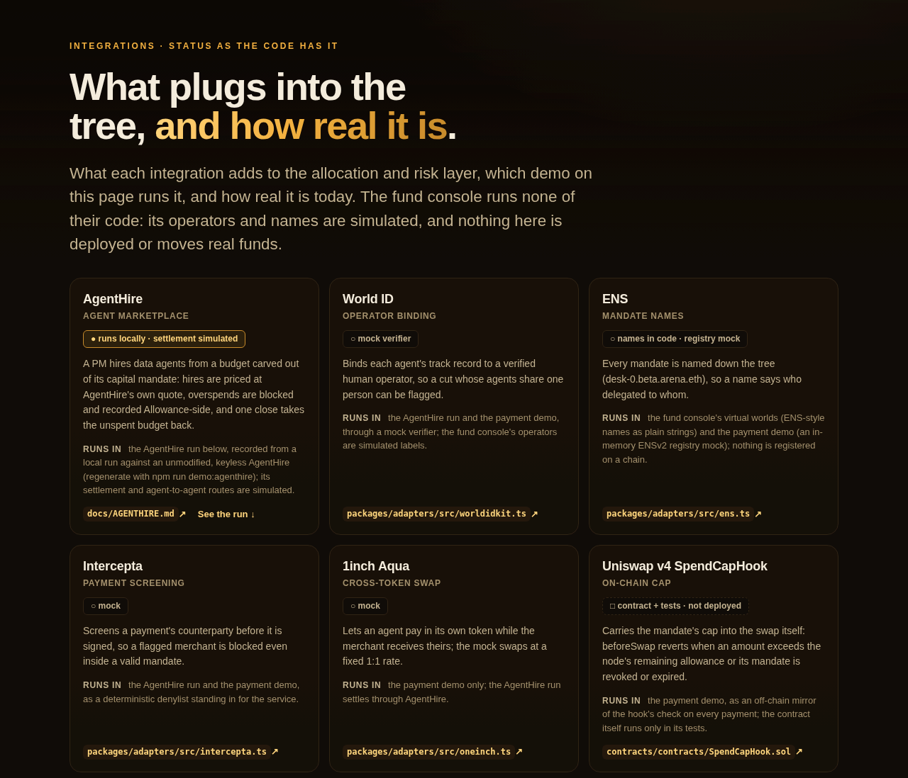

# Allowance

> **The allocation and risk layer for capital run by AI agents.**

A multi-manager fund where the PMs are AI agents. Each agent trades inside a
mandate that can only shrink, carries a track record bound to its human operator
(World-ID-verified in production; mocked in the demos), and the allocator moves capital to the best risk-adjusted agents,
spots when "independent" agents are one trade, and cuts them — a stop-out closes
the agent's whole subtree in one operation. Four guarantees; the allocator makes
the decisions, and each one lands as one operation on one mandate tree:

- **(R) Reserved:** capital is reserved per agent at grant (`delegate`), and every
  order is sized from the agent's available authority in the tree (since loop 3),
  so the book's own accounting can never let an agent trade more than its
  reservation; each order is audited against the tree before it is marked.
- **(A) Adjusted:** reservations are resized from risk-adjusted records (`resize`).
- **(G) Grouped:** agents that are one trade (overlapping positions) are cut as a
  group, by one factor in one pass. Since loop 3 an operator is also one
  counterparty: when one of its agents is stopped out, its other live agents are
  capped together, in one plan, at half their full size until each recovers on
  its own record. The cap is a ceiling kept apart from the agent's own size (what
  its own rules give it), and the agent holds the smaller of the two. However many
  agents the operator runs, and in whatever order they are stopped, cut, restored,
  capped and lifted, an agent holds at least the stricter of its own rules and one
  cap (the two never compound) and never more than its own rules allow (the cap
  never weakens its own ladder). The cap never revokes, and never delays or brings
  forward any agent's own stop-out.
- **(C) Closed:** a stop-out closes the subtree (`DelegationTree.close`), returning
  the agent's capital and every sub-mandate it handed out to its pod in one
  operation (since loop 2). The AgentHire demo shows a close on a live subtree
  that was still paying for work.

`npm run demo:fund` builds the fund console's data from one showcase **virtual
world** (simulated prices, agents and operators; no market data). The mechanism
underneath is the attenuating-delegation primitive described next.

### Screenshots (virtual-world demo)

Captured from the built web app (`npm run build:web`, then `npx vite preview` in
`apps/web`) at 1280 px. Every fund number in them is **simulated**: one showcase
virtual world (seed 1, fixed rule) for the console, and sealed virtual worlds for
the evidence. The showcase world is more favourable than the sealed average.












The drawdown chart is there on purpose: on sealed blocks the center book's
certainty equivalent beats per-agent guardrails (about 11.7% vs 6.1% on loop 2's
block B), but its mean max drawdown is still above theirs (7.75% vs 6.88%).
[`docs/LOOPS.md`](docs/LOOPS.md) is the ledger.

## The mandate primitive

> **Give your AI agents an allowance, not your wallet.**
> An attenuating-delegation protocol for autonomous AI-agent payments.

Allowance lets a human fund a **root agent** with a capped budget, and lets that
agent safely hand slices of that budget down to the sub-agents it spawns. Every
hop can only **narrow** what it received — never broaden it — and every payment
is identity-gated, compliance-screened, settled in any token, and fully audited.

---

## The ELI5 story (allowance & the piggybank)

You give your kid a **$20 allowance**. She can spend it, but she can't reach
into your bank account. If she asks her little brother to buy comics, she hands
him **$5 of her $20** — he can't spend $6, he can't buy fireworks if she said
"comics only," and the moment she takes the $5 back, he's broke.

That's Allowance. The parent is you (the human). The kid is your **root agent**.
The little brother is a **sub-agent**. Each pocket of money is a **mandate**:
a budget, an allowlist of who you can pay and why, and an expiry date. Money
only ever flows *down and narrower*. Pull an allowance and everything below it
stops instantly.

---

## The unsolved niche

Autonomous agents now spawn **sub-agents that spend money**. An orchestrator
hires a researcher, the researcher hires a scraper, the scraper pays an API.
Today the only options are terrible:

- **Give every agent your key/wallet** → one compromised or hallucinating agent
  drains everything.
- **Approve every payment by hand** → defeats the point of autonomy.

Nobody has a clean primitive for **authority that attenuates down a chain**:
each hop narrows its parent's remaining budget/scope, is revocable, and is
auditable end-to-end. **Allowance is that primitive.**

### The wow: ENSv2's name hierarchy *is* the delegation tree

A name like `scraper.researcher.alice.eth` already encodes who-is-boss-of-whom
(**left-most label is the node itself**). ENSv2 makes each name its own
sub-registry with per-record resolver permissions — so we store each agent's
**mandate** (budget/scope/expiry) as resolver records on its name. The naming
tree and the authority tree are the **same tree**. Attenuation just means: a
child's budget is always a slice of its parent's *remaining* budget.

---

## Quickstart

```bash
npm install          # root install (installs all workspaces once)
npm run demo         # runs the full storyline offline, writes the snapshot
npm run dev:web      # opens the dashboard that renders the snapshot
```

- `npm run demo` executes the eight-step storyline below **entirely on
  deterministic mocks** (no network, no credentials) and writes
  `apps/web/public/demo-snapshot.json`.
- `npm run dev:web` serves the React dashboard that visualizes the spend tree
  and the event ledger from that snapshot.
- `npm run demo:fund` runs the **fund console** data: the current center book vs
  per-agent guardrails on one showcase virtual world from the arena, picked by a
  fixed rule (the smallest research seed ≥ 1 with a crowd, an operator running
  two agents and ≥ 2 skilled pickers). It writes `apps/web/public/fund-snapshot.json`
  with per-agent series, the decision log, group cuts (one-trade vs book-wide,
  with shared operators flagged), stop-outs (one `close` each, with the amount freed),
  the mandate tree at every decision tick and a summary of the sealed loop
  results in `docs/loops/` (only merged, confirmed changes are plotted).
- `npm run demo:swarm` runs the **center book** (below): a Tiger-Cub fund of
  agents, head-to-head vs per-agent guardrails, a 20-seed sweep and an
  ablation. It writes `apps/web/public/swarm-snapshot.json`.
- `npm run demo:agenthire` runs the **AgentHire** story (below) against a local
  AgentHire booted with `scripts/agenthire-up.sh`. It writes
  `apps/web/public/agenthire-snapshot.json` and a receipts sidecar. AgentHire's
  prices move (surge) and the run is timestamped, so each run rewrites both
  files with different quotes and audit counts. The event sequence follows the
  PM's simulated path, so it changes when the Tiger overlay changes (loop 4
  added a restore and a second cut); regenerate both files after such a change.
- `npm run typecheck` runs `tsc -b` across every package.
- `npm test` runs the aggregated Node test suite (core, adapters, swarm, lab and
  orchestrator).
  See [Testing](#testing) for the full matrix, including the web and Solidity suites.

---

## From one agent to a fund of them: the center book

Guardrails on a single agent are table stakes. What's differentiated is what a
multi-manager ("pod shop") fund does **across** its PMs when the PMs are agents
trading real capital. `@allowance/swarm` is that center book, built directly on
the mandate tree:

- **Allocation is a `resize`, a stop-out is a `close`.** Fund → pod → agent is
  a mandate tree, and every allocator action lands in the same audited event
  log as payments.
- **Allocation uses risk-adjusted, attributable returns, and is
  correlation-aware.** Clones split one allocation.
- **A risk-scaled drawdown ladder:** cut at 10% and stop out at 20%,
  widened for a volatile agent to 1.5× the volatility it runs (measured up to its
  last high-water mark, so a loss cannot loosen its own stop), and never past a
  40% ceiling, so every agent can still be stopped out. A stop-out is one
  `tree.close`: the agent's capital and every sub-mandate it handed out go back
  to its pod. The book audits the tree's reservation and close invariants before
  and after every tick.
- **The reservation is the binding limit.** Every agent's trade is sized from
  its mandate's *available* authority in the tree (budget − its own spend − what
  it handed to sub-mandates) × leverage, not from a number the book keeps, and
  each order is audited against the tree before it is marked.
- **Crowding control.** Agents in different pods running the same trade are cut
  back to a book-level limit, even when each is inside its own mandate.

The example portfolio **runs like a Tiger Cub**:
1. Start from a trend: rising global coffee consumption, with dated and sourced
   research.
2. Score every exposed company on three questions: *good company? good
   management? why now?*
3. Own only a company that is "yes" to all three (**SBUX**), paired with a short
   that rides the same trend but fails "why now?" (**BROS**).
4. Size into dated catalysts.

Three Tiger-Cub agents in three pods, each weighting the questions differently,
all land on SBUX: a hedge-fund hotel. Over 20 synthetic markets, the center book
cuts mean max drawdown from **7.9% to 5.6%**, the loss in the crowd's unwind
from **−4.9% to −2.5%**, and peak crowded exposure from **52% to 15% of NAV**,
at the same mean Sharpe (0.50). It gives up return to do it (+2.8% vs +5.5%). An
ablation shows crowding control is where the value comes from. This small
example does not show the improvement loops' gains: across 200-world blocks of
the virtual-world arena the center book's certainty-equivalent return beats the
per-agent baseline's (14.4% vs 8.6% on loop 3's confirmation block). Its raw max
drawdown is about the same or higher (6.6% vs 6.5% there; 7.7% vs 6.9% on loop
2's block), because it runs more volatility; at the baseline's volatility its
drawdown is lower (5.9%). How each number was judged:
[`docs/LOOPS.md`](docs/LOOPS.md).

Full write-up, including what didn't help: [`docs/CENTER-BOOK.md`](docs/CENTER-BOOK.md).
Prices are synthetic and the research is illustrative; this is not investment
advice.

---

## A live agent marketplace: AgentHire

[AgentHire](https://github.com/shalpate/agenthire) is a Flask marketplace where
agents are hired over x402 and hire each other. The integration runs against an
unmodified, keyless AgentHire on `127.0.0.1`:

```bash
bash scripts/agenthire-up.sh        # 127.0.0.1:5301 (PORT=... for another port)
npm run demo:agenthire              # AGENTHIRE_URL=http://127.0.0.1:<port> for another port
bash scripts/agenthire-down.sh
```

In the demo, a fund's Luckin PM gets a capital mandate. It hires AgentHire's
WebCrawler X, at its quote, to pull Baidu Maps store counts. The steps:

1. The scraper's budget, and those of WebCrawler X's own sub-hires, are sized
   from AgentHire's quotes.
2. Before signing the x402 permit, Allowance checks that the amount is
   AgentHire's own quote, and checks the chain, the token, the recipient and
   how long the permit stays valid. AgentHire's server does not check these.
3. Acting for WebCrawler X (scripted by the demo), the scraper's sub-hire node
   tries twice to spend past its mandate. It is blocked both times, and an
   incident (not a slash) lands on Allowance's record for its operator.
4. A second buyer, whose own services load that record from disk, is refused
   at screening.
5. The allocator's drawdown ladder stops the PM out on a synthetic (simulated)
   track record. A single `tree.close()` then frees the PM's capital and kills
   the data budget while it still holds a full hire at every level.
6. A shadow audit replays AgentHire's own agent-to-agent hires through `pay()`
   and reports how many would have been blocked even under AgentHire's own
   displayed Hard Spend Cap.

In keyless mode AgentHire's settlement and A2A routes are simulated, and its
escrow is off-chain in live flows, so nothing here claims escrow protection.
The `AGENTHIRE_SETTLE=fuji` path has not been run from this sandbox, and as
shipped it cannot settle without a funded payer (`AGENTHIRE_PAYER_KEY`).
Details, gaps with file:line references, and what is real vs simulated:
[`docs/AGENTHIRE.md`](docs/AGENTHIRE.md).

---

## Architecture (at a glance)

```
                         ┌─────────────────────────────┐
   human principal  ───► │  World IDKit (PrincipalVerifier) │  verify to fund
   (alice)               └──────────────┬──────────────┘
                                        │ fundRoot(100 USDC)
                                        ▼
   ENSv2 name hierarchy  =  DELEGATION TREE (packages/core · tree.ts)
   ┌──────────────────────────────────────────────────────────────┐
   │  alice.eth                     budget 100 · avail 65          │
   │   └─ researcher.alice.eth      budget 30  · avail 12  (REVOKED)│
   │        └─ scraper.researcher.alice.eth   budget 10            │
   │   └─ ghost.alice.eth           identity: expired              │
   └──────────────────────────────────────────────────────────────┘
        each edge = delegate(): child mandate ⊆ parent remaining (ATTENUATION)

   pay(node, merchant, amount, purpose)   [packages/core · payment.ts]
        │
        ├─(1) identity  ── IdentityGate      ─► World ID for Agents   (DENIED_IDENTITY)
        ├─(2) mandate   ── tree checks       ─► revoked/expired/cap   (BLOCKED_MANDATE / REVOKED)
        ├─(3) screening ── ScreeningService  ─► Intercepta live check (BLOCKED_SCREENING)
        └─(4) settle    ── SettlementService ─► 1inch Aqua swap       (SETTLED)
                                        │
                                        ▼
        contracts/  ── Uniswap v4 hook / settlement guard enforces the cap on-chain
                                        │
                                        ▼
   snapshot JSON  ──►  apps/web (React dashboard)  +  Curvegrid MultiBaas dashboard
```

**Data flow:** agent action → `@allowance/core` (attenuation + payment pipeline)
→ `@allowance/adapters` (sponsor ports, mock or real) → snapshot JSON →
`apps/web` dashboard. On-chain enforcement lives in `contracts/`.

---

## Sponsor prize → feature map

Each track is **real, not cosmetic** — it satisfies a load-bearing part of the
protocol. Full submission checklist in [`docs/SPONSORS.md`](docs/SPONSORS.md).

| Prize (amount) | What satisfies it | Where |
| --- | --- | --- |
| **ENS** ($6k) | Subname hierarchy **is** the delegation/authority tree; mandates stored as resolver records | `packages/core/src/tree.ts` (name helpers, `DelegationTree`) |
| **World ID for Agents** ($5k) | `IdentityGate` port — every `pay()` verifies the node + ancestors first; supports denied/expired path | `packages/core/src/payment.ts`, `packages/adapters` (`MockIdentityGate`, `WorldAgentIdentityGate`) |
| **World IDKit** ($5k) | `PrincipalVerifier` port — human verifies to fund the root; success **and** failure path | `packages/adapters` (`MockPrincipalVerifier`, `WorldIDKitVerifier`), `services/orchestrator/src/demo.ts` |
| **Intercepta** ($2k) | `ScreeningService` port — live screen runs **before** settlement; approved **and** blocked | `packages/adapters` (`MockScreeningService`, `InterceptaScreeningService`) |
| **1inch Aqua** ($5k) | `SettlementService` port — swap payer token → merchant token via Aqua/SwapVM | `packages/adapters` (`MockSettlementService`, `AquaSettlementService`) |
| **Uniswap** ($6k) | v4 hook / settlement guard enforcing the attenuated cap on-chain; ships `docs/FEEDBACK.md` | `contracts/`, [`docs/FEEDBACK.md`](docs/FEEDBACK.md) |
| **Curvegrid** ($1k×3) | AI agent reads chain state + MultiBaas-style dashboard of the spend tree | `apps/web` (spend-tree view), reads snapshot/chain |
| **Sui** ($5k, stretch) | Programmable escrow/settlement rail (non-EVM) | optional |

---

## Demo storyline

`npm run demo` runs these eight steps, then writes the snapshot the dashboard
renders. (Budgets in USDC, 6 decimals.)

| # | Action | Result |
| --- | --- | --- |
| a | Human **alice** verifies via IDKit; funds root **alice.eth** with **100 USDC** (merchants = any). | `FUND` / `OK` |
| b | `alice.eth` delegates **30 USDC** → `researcher.alice.eth` (merchants `{arxiv, openai, sanctioned-vendor}`). | `DELEGATE` / `OK` |
| c | `researcher` delegates **10 USDC** → `scraper.researcher.alice.eth` (merchants `{arxiv}`). | `DELEGATE` / `OK` |
| c′ | `researcher` tries to delegate **999 USDC** → `greedy.researcher.alice.eth` — more than it has. | `DELEGATE` / `ATTENUATION_REJECTED` |
| d | `scraper` tries to pay **15 USDC** (arxiv) — exceeds its 10 available. | `PAYMENT` / `BLOCKED_MANDATE` |
| e | `researcher` pays **5 USDC** to `sanctioned-vendor` — **Intercepta blocks**. | `PAYMENT` / `BLOCKED_SCREENING` |
| f | `researcher` pays **8 USDC** to `openai` (USDC → merchant token via **Aqua**). | `PAYMENT` / `SETTLED` (`swapped:true`) |
| g | `alice.eth` delegates to `ghost.alice.eth`, whose identity has **expired**; ghost tries to pay. | `DELEGATE` / `OK`, then `PAYMENT` / `DENIED_IDENTITY` |
| h | `alice` **revokes** `researcher.alice.eth`; `scraper` then pays. | `REVOKE` / `REVOKED`, then `PAYMENT` / `REVOKED` |

**Verify the math:** post-run, `alice.eth` available = **65 USDC** (100 − 30 − 5),
`researcher.alice.eth` available = **12 USDC** (30 − 10 reserved − 8 spent),
**11 events** total. Steps d/e/g/h are the required **failure/blocked** demos.

---

## Testing

Every layer of the protocol is exercised by a deterministic suite with no
credentials and no live chain. The Node and web suites run offline; the Solidity
suite needs network access once, for Hardhat to download the `solc` compiler.
There are three runners, split by the toolchain each layer needs:

| Command | Runner | Covers |
| --- | --- | --- |
| `npm test` | Node `--test` (tsx loader) | `@allowance/core` (attenuation, tree, close, audit, payment gauntlet) + `@allowance/adapters` (sponsor ports, AgentHire, shadow audit) + `@allowance/swarm` (center book, close, Tiger-Cub process, example thesis) + `@allowance/lab` (series, metrics, strategy, research, close in the arena) + `@allowance/orchestrator` (demo flow, fund-console snapshot) |
| `npm -w @allowance/lab run test` | Node `--test` (tsx loader) | the research lab and the virtual-world arena |
| `npm -w allowance-web run test` | Node `--test` (tsx loader) | web fetch-boundary logic: payment, swarm, AgentHire and fund-console snapshot validation, amount formatting, tree view-model, console replay and log folding |
| `npm -w @allowance/contracts test` | Hardhat (`hardhat test`) | Solidity: `MandateRegistry`, `SpendCapHook`, screening `Escrow` |

You can also run any layer in isolation:
`npm -w @allowance/core test`, `npm -w @allowance/adapters test`,
`npm -w @allowance/orchestrator test`.

### What each module's tests guarantee

| Module | Test file | Guarantees |
| --- | --- | --- |
| `@allowance/core` — attenuation | `packages/core/src/attenuation.test.ts` | A child mandate is always a slice of its parent's *remaining* budget; a hop can only **narrow** budget/merchants/expiry, never broaden them; over-broad delegations are rejected. |
| `@allowance/core` — tree | `packages/core/src/tree.test.ts` | ENS subname helpers (parent/label parsing) and `DelegationTree` — insert/lookup, remaining-budget accounting, revoke cascades over the subtree. |
| `@allowance/core` — payment | `packages/core/src/payment.test.ts` | The four-stage `pay()` gauntlet in order — identity → mandate → screening → settle — with each blocked/denied/revoked path; amount round-trips through settlement without precision loss. |
| `@allowance/adapters` | `packages/adapters/src/adapters.test.ts` | Sponsor ports on deterministic mocks: Intercepta screening **block**, 1inch Aqua swap-rate math, identity/principal verification paths, and the `SpendCapHook` mirror of the on-chain cap. |
| `@allowance/adapters` — AgentHire | `packages/adapters/src/agenthire.test.ts` | Against a fake AgentHire: settlement refuses any amount that is not AgentHire's quote (with or without a `QuoteBook`, whose entries only `fetch()` can add), and any challenge whose chain, token, recipient, domain or `validBefore` disagrees with the mandate, and signs nothing; before a permit is sent HTML 429s and timeouts are refusals, after it they are charged as UNCONFIRMED so a node cannot spend the same authority twice (Fuji 402 and timeout cases); sub-agent budgets split `cap − main` to the micro and are delegated all-or-nothing; repeated overspend becomes an operator incident plus a dispute (never a slash), persisted so a fresh ledger in another process screens the next buyer out; `SerializedPayer` stops two payments, even from two payer instances, spending one leftover. |
| `@allowance/adapters` — shadow audit | `packages/adapters/src/agenthire-audit.test.ts` | On a recorded AgentHire capture: A2A hires link to their primary job, direct and orphan hires are excluded, cycles and shared children get one alias node per parent, the headline comes from the replay-decided Hard Spend Cap scenario while `strict` is the by-definition total, `--organic-only` drops demo-cascade jobs, and AgentHire operator screening plugs into the replay. |
| `@allowance/core` — close | `packages/core/src/tree.test.ts` | `close` shrinks a subtree to what it spent, revokes it, and returns exactly what the parent's `available` rises by; never shrinks a parent below what its subtree really spent (even after an unserialized overspend); idempotent; reclaims budget under individually revoked descendants. |
| `@allowance/core` — invariants | `packages/core/src/tree.test.ts` | `audit()` is empty for any tree built through the API and flags over-commitment (children + spend > budget, incl. an unserialized overspend), broadened merchants/purposes/expiry, negative budgets and broken links; `isClosed` separates a close (no unspent authority left) from a bare revoke (authority stranded); nothing can be delegated anywhere inside a closed subtree. |
| `@allowance/swarm` — close | `packages/swarm/src/close.test.ts` | With PMs holding sub-mandates that pay every tick, the tree is checked from outside at every tick under three policies: children ≤ parent, available ≥ 0, sub-mandates hold exactly their ppm slice of the PM (never more), a closed subtree's budgets are frozen and it can never pay, delegate or grow; every stop-out is exactly one `close` freeing budget − spent into the pod; shares are validated in the ppm they are cut in; the book's audit stops a broken tree before the tick trades (and a mid-tick break at that tick's end); spent authority is a floor no resize crosses, and a grow the fund cannot fund is clipped, never refused. |
| `@allowance/lab` — close in the arena | `packages/lab/src/arena-close.test.ts` | On randomized arena rosters with desks that spend every tick, center book and guardrails both run to the end on a sound tree, every stop-out is one `close` of the agent with its desks, and no move is refused. |
| `@allowance/swarm` — reservation binds | `packages/swarm/src/reserve.test.ts`, `packages/lab/src/arena-reserve.test.ts` | Every order is checked from outside at the trade, on books where a PM's budget overstates what it may trade (desks, its own spend, an outside grant) and on randomized arena rosters: it is sized on no more than the mandate's available authority, its gross notional is within available × leverage, a closed PM trades nothing, and the marked PnL is exactly the audited order's; an order inflated for one PM (tree untouched) stops the book at the trade naming that PM; orders are sized after the crowding cuts; the book's reallocations and cuts are made on the tree's budgets. |
| `@allowance/swarm` — operator counterparty | `packages/swarm/src/counterparty.test.ts`, `packages/lab/src/arena-counterparty.test.ts` | When one of an operator's agents is stopped out, its other live agents are capped as a group in one plan at `cutFactor` of their full size; the cap is a ceiling on capital, so it never compounds with a ladder cut or an earlier cap; it never revokes; every stop-out happens on exactly the tick the agent's own record, replayed alone, breaches its own stop; on the arena's shared-operator worlds a name is revoked if and only if its own ladder stopped it. |
| `@allowance/swarm` — operator sizing | `packages/swarm/src/operator-sizing.test.ts`, `packages/lab/src/arena-operator-sizing.test.ts` | For any number of names per operator (1–5 tested) and any order of stop-outs, caps, lifts, re-caps, ladder cuts and restores, crowding cuts and reallocations, a name holds min(own size, one cap) ≤ budget ≤ own size, where its own size is what its own rules give it. This is checked four ways. (1) Case by case. (2) As a property of the pure pieces the book composes, over random event sequences against an independent reference model; the same harness finds counterexamples in loop 3's rule and loop 4's rejected rule. (3) On a scripted book with loop 4's counterexample (three names, a lift, a re-cap, then the name's own ladder cut), against the same book without labels. (4) On 40 random crowding-free books, where the own size equals the budget in the same book without labels, tick by tick. On arena worlds regrouped into operators of 1–5 names, crowding included, the band holds at every tick, no cap or lift moves an own size, and the cap binds until it lifts. |
| `@allowance/core` — replay | `packages/core/src/replay.test.ts`, `packages/swarm/src/reserve.test.ts` | Every API path (fundRoot, delegate, resize, close, revoke, settled and blocked payments) replays from the event log to the live tree exactly, over random operation sequences; a direct write that bypasses the API is caught at the next audit, even one that keeps every invariant or is later overwritten by a resize; the book runs the check at every audit. |
| `@allowance/swarm` + adapters — stop-out incidents | `packages/swarm/src/incidents.test.ts`, `packages/adapters/src/operator-record.test.ts`, `packages/lab/src/arena-incidents.test.ts` | One "stop-out" incident per STOP_OUT, keyed by the agent's operator (absent, not guessed, when it has none), with tick and exactly what `close` freed; the book's output is identical with and without a sink; hire and grant screening refuse only operators over their stop-out limit, kept apart from the misconduct limit; a refused grant creates no node. |
| `@allowance/core` — resize | `packages/core/src/tree.test.ts` | `resize` grows only from the parent's available budget, never cuts below what a node has committed, lets the root only shrink, and refuses revoked subtrees — each attempt audited as `RESIZE`. |
| `@allowance/swarm` — allocator | `packages/swarm/src/allocator.test.ts` | Clones split one allocation; losers and stopped agents get nothing; the drawdown ladder cuts, restores and stops (stop is final); risk-scaled rungs are never tighter than the fixed ones nor looser than the 40% ceiling, and σ is measured only up to the last high-water mark (`volAtHighWater`), so a crash cannot loosen its own stop; clone-cluster and book-level crowding limits scale contributors back exactly to the limit; the pre-trade gate drops off-mandate instruments, clips gross, and flattens revoked agents. |
| `@allowance/swarm` — Tiger Cub | `packages/swarm/src/tigercub.test.ts` | A long needs "yes" to all three questions (a great company with no catalyst is not enough); the short rides the same trend but fails "why now"; PM weightings re-rank but never waive the gate; catalyst dates map onto trading-day ticks; positions size up into catalysts with gross ≤ 1. |
| `@allowance/swarm` — book | `packages/swarm/src/book.test.ts` | The mandate tree stays valid through every reallocation, cut and stop-out (stopped agents are closed with zero budget; no rejected moves); runs are deterministic; cross-pod clones are caught before the unwind and only by the center book. |
| `@allowance/swarm` — example | `packages/swarm/src/example.test.ts` | The coffee thesis is well-formed (scores 1–5, sourced trend claims, parseable catalyst dates); the three Tiger Cubs converge on one long; the center book flags it on day one and loses less in the unwind. |
| `@allowance/orchestrator` | `services/orchestrator/src/flow.test.ts` | `executePayment` reaches every `PaymentOutcome`; in each, the off-chain result **agrees** with the `SpendCapHook` cap decision (hook agreement), the emitted event matches the record, and a settled payment moves the node's ENS `spentDirect` record in lock-step. |
| `allowance-web` — snapshot | `apps/web/src/snapshot.test.ts` | Runtime validation of `demo-snapshot.json` against the frozen schema: well-formed input round-trips unchanged; malformed/stale input throws a precise, path-tagged `SnapshotParseError`. |
| `allowance-web` — format | `apps/web/src/format.test.ts` | Smallest-unit integer strings render to human token amounts via BigInt (no float drift), including fractional, zero, and negative values. |
| `allowance-web` — tree | `apps/web/src/tree.test.ts` | `buildTree` reconstructs the delegation hierarchy from the flat `nodes` array and marks a node `effectivelyRevoked` when it or any ancestor is revoked (dashboard view models). |
| `@allowance/contracts` — MandateRegistry | `contracts/test/MandateRegistry.test.ts` | On-chain delegation tree: attenuating `delegate`, cap enforcement, and revoke cascades match the off-chain `DelegationTree` semantics. |
| `@allowance/contracts` — SpendCapHook / Escrow | `contracts/test/SpendCapHook.test.ts`, `contracts/test/Escrow.test.ts` | The Uniswap v4 hook rejects swaps that exceed the attenuated cap; the screening escrow releases only after an approved screen. |

The suites are the guardrail for every invariant in [`DESIGN.md`](DESIGN.md): the
snapshot schema (§7) is pinned by the web snapshot tests, and the storyline
outcomes (§8: balances, outcomes, 11 events) by `npm run demo`'s own
assertions, which fail the run on any mismatch. Do not weaken or skip a
test to force a green run — fix the code instead.

---

## Repo layout

```
packages/core         @allowance/core         pure domain: types, attenuation, tree, payment engine (zero runtime deps)
packages/adapters     @allowance/adapters     sponsor ports: deterministic mock + real-integration stub
packages/swarm        @allowance/swarm        the center book: agent swarm, allocator, Tiger-Cub process, coffee thesis
packages/lab          @allowance/lab          research lab (Luckin study; runs only on price data fetched and cross-checked with `npm run lab -- fetch`, none checked in) + the virtual-world arena
services/orchestrator @allowance/orchestrator x402 flow + demo runners (demo, demo:fund, demo:swarm, demo:agenthire)
scripts/              agenthire-up.sh / agenthire-down.sh (local keyless AgentHire), agenthire-audit.ts (shadow audit),
                      loop-driver.mjs / loop-judge.mjs / worktree-setup.sh (sealed improvement loops)
apps/web              allowance-web           Vite + React dashboard of the spend tree + event ledger
contracts             solidity (Hardhat)      Uniswap v4 hook / settlement guard enforcing the cap on-chain
docs/                 ARCHITECTURE.md · SPONSORS.md · FEEDBACK.md · CENTER-BOOK.md · LOOPS.md (+ loops/) · AGENTHIRE.md · AGENTHIRE-SHADOW-AUDIT.md
DESIGN.md             authoritative spec — locked types, signatures, and the storyline
```

## Docs

- [`DESIGN.md`](DESIGN.md) — the authoritative, locked spec. See
  [§11 Web UX states & motion performance](DESIGN.md#11-web-ux-states--motion-performance-appsweb-invariants)
  for the dashboard's four render states (loading skeleton / error / empty /
  ready) and the motion-performance invariants (`LazyMotion` + `m`, code-split
  dashboard, GPU-only animation, `content-visibility`, reduced-motion, no
  external fonts/CDNs) — read it before touching `apps/web`.
- [`docs/CENTER-BOOK.md`](docs/CENTER-BOOK.md) — the center book and the Tiger-Cub example portfolio: design, results, ablation, limits.
- [`docs/LOOPS.md`](docs/LOOPS.md) — the improvement loops: protocol (sealed virtual worlds, risk guard), every candidate with its verdict, corrections found by post-push verification. Reports and diffs in [`docs/loops/`](docs/loops/).
- [`docs/AGENTHIRE.md`](docs/AGENTHIRE.md) — the AgentHire integration: the demo, the gaps it closes, what is simulated, the Fuji switch. The shadow audit has its own page: [`docs/AGENTHIRE-SHADOW-AUDIT.md`](docs/AGENTHIRE-SHADOW-AUDIT.md).
- [`docs/ARCHITECTURE.md`](docs/ARCHITECTURE.md) — domain model, attenuation rule, payment pipeline, data flow, on-chain vs off-chain split.
- [`docs/SPONSORS.md`](docs/SPONSORS.md) — per-track submission checklist with the required failure-path demos flagged.
- [`docs/FEEDBACK.md`](docs/FEEDBACK.md) — the Uniswap-required developer feedback.
